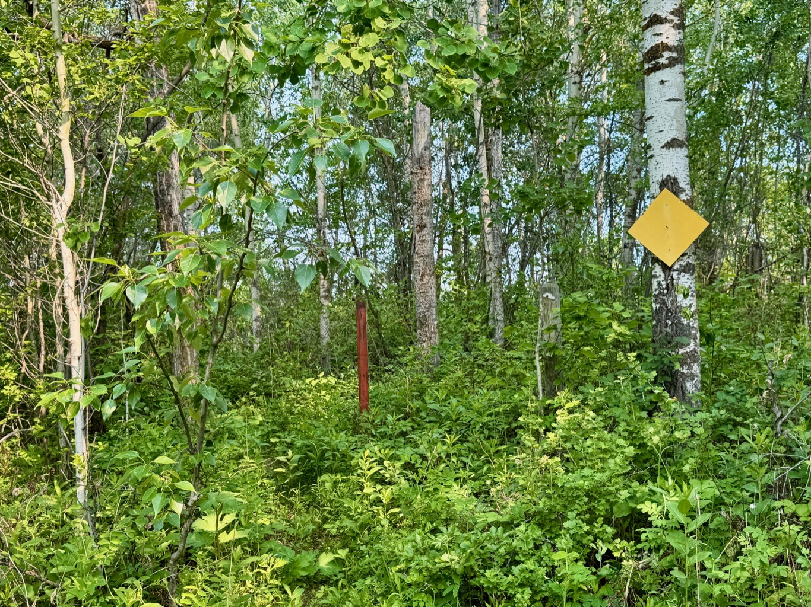

  

    <h4 class="text-xl font-large mt-0">Trailhead Details</h4>
      <table width=100% class="w-full">
      <tbody>
        <tr>
          <td valign="top" width="100%" class="mb-2 text-base" colspan="2"><b>🧭 GPS Location</b></td>
        </tr>
        <tr>
          <td valign="top" colspan="2" class="my-4 text-base"><b>Trailhead:</b>  <a href="https://maps.app.goo.gl/U5CtkTNvsuVEa32s9" target="_blank">N53 22.026 W112 57.994</a>(Opens in Google Maps) 
          
<a href="geo:53.367100,-112.966567">53.367100,-112.966567</a> (Opens in your default map app)

          
<a href="w3w://show?threewords=daisies.lenders.reversible">///daisies.lenders.reversible</a> (Opens in what3words - mobile only)

          </td>
        </tr>
        <tr>
          <td valign="top" class="mb-2 text-base"><b>🅿️ Parking</b>   <a href="https://maps.app.goo.gl/p6NFvhybbCuPJVet9" target="_blank">N53 22.014 W112 57.904</a> (UofA Access Road Gate) 
          
<a href="geo:53.366900,-112.965067">53.366900,-112.965067</a> (Opens in your default map app)

          
<a href="w3w://show?threewords=liberally.bouts.unworn">///liberally.bouts.unworn</a> (Opens in what3words - mobile only)
</td>
        </tr>
        <tr>
          <td valign="top" colspan="2" class="my-4 text-base"><ul><li>The Waskahegan Berg Section - South Trailhead is a bit different from other Ministik trailheads in that there is no safe parking at the trailhead itself. But parking is very close nearby at the U of A Access Gate.</li>
          <li>Once parked near the gate, walk for about 3 minutes west, cross the road and ditch and access the trailhead to start your hike.</li></ul></td>
        </tr>
      </tbody>
      </table>
  

