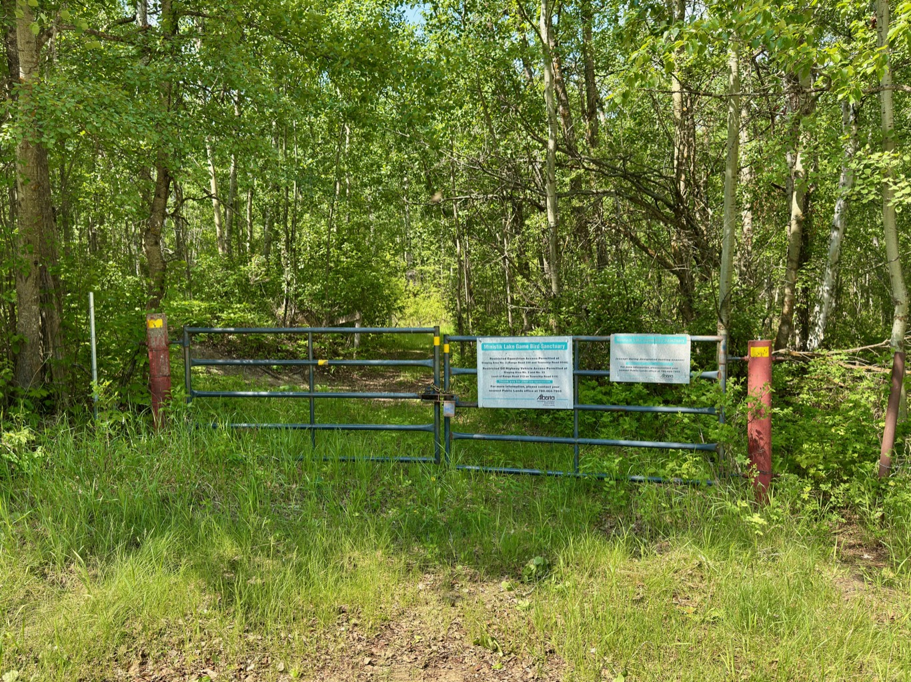

  

    <h4 class="text-xl font-large mt-0">Trailhead Details</h4>
      <table width=100% class="w-full">
      <tbody>
        <tr>
          <td valign="top" width="100%" class="mb-2 text-base" colspan="2"><b>🧭 GPS Location</b></td>
        </tr>
        <tr>
          <td valign="top" colspan="2" class="my-4 text-base"><a href="https://maps.app.goo.gl/YS7tw7hvdTVwUtMd7" target="_blank">N53 18.453 W112 55.686</a> (Opens in Google Maps) 
          
<a href="geo:53.307550,-112.928100">53.307550,-112.928100</a> (Opens in your default map app)

          
<a href="blanking.memorandum.sweeper://show?threewords=blanking.memorandum.sweeper">///blanking.memorandum.sweeper</a> (Opens in what3words - mobile only)

          </td>
        </tr>
        <tr>
          <td valign="top" class="mb-2 text-base"><b>🅿️ Parking</b></td>
        </tr>
        <tr>
          <td valign="top" colspan="2" class="my-4 text-base">
Named for a former nearby land owner, Fairbrother corner provides you with immediate access to the Waskahegan Trail. When you walk past the gate the Waskahegan extends both directly east and directly south.

There is ample parking here because there is no ditch to speak of and ample space between the road and the treeline. This means you can easily safely park multiple vehicles off the road.
</td>
        </tr>
      </tbody>
      </table>
  

