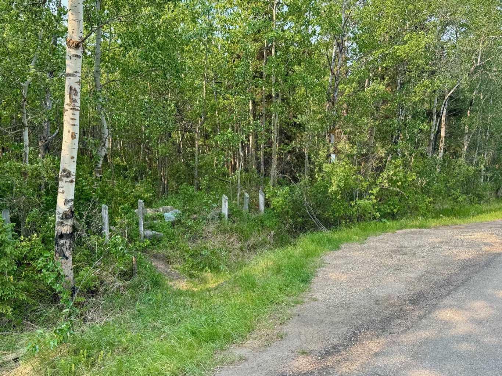

  

    <h4 class="text-xl font-large mt-0">Trailhead Details</h4>
      <table width=100% class="w-full">
      <tbody>
        <tr>
          <td valign="top" colspan="2" class="my-4 text-base"><a href="https://maps.app.goo.gl/rT9MCK823RFvHCgt8" target="_blank">N53 22.011 W113 00.100</a>(Opens in Google Maps) 
          
<a href="geo:53.366850,-113.001667">53.366850,-113.001667</a> (Opens in your default map app)

          
<a href="smartphone.eloquently.warrant://show?threewords=smartphone.eloquently.warrant">///smartphone.eloquently.warrant</a> (Opens in what3words - mobile only)

          </td>
        </tr>
        <tr>
          <td valign="top" class="mb-2 text-base"><b>Parking:</b></td>
        </tr>
        <tr>
          <td valign="top" colspan="2" class="my-4 text-base">
This trailhead offers somewhat meager parking: one good-sized car can safely pull off the road and park in front of the gate here. If two people are driving Mini Coopers, then maybe two cars. 😃 When parking, beware of the steep ditches here. Especially in winter it's all too easy to slide into the ditch where you'll probably need AMA assistance to get you back out.
 
The "Francis Edward Williams" Trailhead is named after the third "Game Guardian" on the Ministik Lake Game Sanctuary from 1936 to 1954. Just past the trailhead to the right you'll see a cement foundation of the house Mr Williams lived with this family. (<a href="https://www.geocaching.com/geocache/GC3GJ0B_gg3-francis-edward-williams">source</a>)
</td>
        </tr>
      </tbody>
      </table>
  

