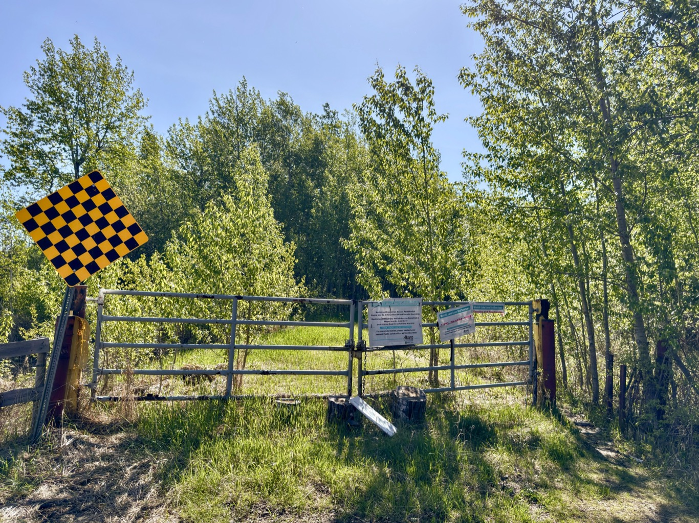

  

    <h4 class="text-xl font-large mt-0">Trailhead Details</h4>
      <table width=100% class="w-full">
      <tbody>
        <tr>
          <td valign="top" width="100%" class="mb-2 text-base" colspan="2"><b>🧭 GPS Location</b></td>
        </tr>
        <tr>
          <td valign="top" colspan="2" class="my-4 text-base"><a href="https://maps.app.goo.gl/cVHyYcdgvbA8PDfR7" target="_blank">N53 18.528 W113 00.084</a> (Opens in Google Maps) 
          
<a href="geo:53.308800,-113.001400">53.308800,-113.001400</a> (Opens in your default map app)

          
<a href="w3w://show?threewords=forthright.sands.swab">///forthright.sands.swab</a> (Opens in what3words - mobile only)

          </td>
        </tr>
        <tr>
          <td valign="top" class="mb-2 text-base"><b>🅿️ Parking</b></td>
        </tr>
        <tr>
          <td valign="top" colspan="2" class="my-4 text-base"><ul><li>The Mandy Lake Road trailhead is well-used in all seasons. Although it is at the end of Township Rd 502, past any local farmyards, it gets maintenance attention in all seasons.</li> 
          <li>There is ample parking along the small pond side of the road. Please don't block the gate even though it is seldom, if ever, used.</li></ul></td>
        </tr>
      </tbody>
      </table>
  

