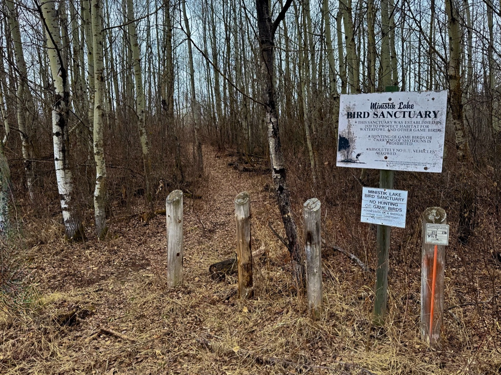

 
  

  

  

    <h4 class="text-xl font-large mt-0">Trailhead Details</h4>
      <table width=100% class="w-full">
      <tbody>
        <tr>
          <td valign="top" width="100%" class="mb-2 text-base" colspan="2"><b>🧭 GPS Location</b></td>
        </tr>
        <tr>
          <td valign="top" colspan="2" class="my-4 text-base"><a href="https://maps.app.goo.gl/34r3stN2LZ2viuLe7" target="_blank">N53 21.431 W112 55.686</a>(Opens in Google Maps) 
          
<a href="geo:53.357183,-112.928100">53.357183,-112.928100</a> (Opens in your default map app)

          
<a href="wolves.installing.suspicions://show?threewords=wolves.installing.suspicions">///wolves.installing.suspicions</a> (Opens in what3words - mobile only)

          </td>
        </tr>
        <tr>
          <td valign="top" class="mb-2 text-base"><b>🅿️ Parking</b></td>
        </tr>
        <tr>
          <td valign="top" colspan="2" class="my-4 text-base"><ul><li>Like the trail, this trailhead seems seldom used, but because it is situated along a quiet road, it offers plenty of parking space in any season. In season, you can pull off the road into the very shallow ditch or simply park as far off the road as possible if snow is factor.</li><li>The name for this trail was coined by local geocachers. In Plains Cree, "misasin" means “rather large, but not overly large” and that seems appropriate for the trail.</li>
          </ul></td>
        </tr>
      </tbody>
      </table>
  

