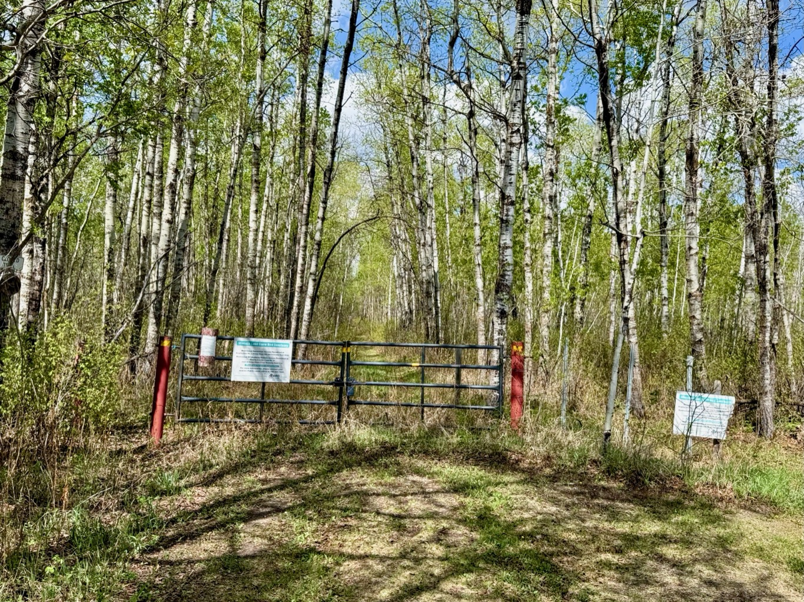

  

    <h4 class="text-xl font-large mt-0">Trailhead Details</h4>
      <table width=100% class="w-full">
      <tbody>
        <tr>
          <td valign="top" width="100%" class="mb-2 text-base" colspan="2"><b>🧭 GPS Location</b></td>
        </tr>
        <tr>
          <td valign="top" colspan="2" class="my-4 text-base"><a href="https://maps.app.goo.gl/aWebodVdiCCcVfgQ7" target="_blank">N53 20.188 W112 55.673</a>(Opens in Google Maps) 
          
<a href="geo:53.336467,-112.927883">53.336467,-112.927883</a> (Opens in your default map app)

          
<a href="pyramid.anchor.grills://show?threewords=pyramid.anchor.grills">///pyramid.anchor.grills</a> (Opens in what3words - mobile only)

          </td>
        </tr>
        <tr>
          <td valign="top" class="mb-2 text-base"><b>🅿️ Parking</b></td>
        </tr>
        <tr>
          <td valign="top" colspan="2" class="my-4 text-base"><ul><li>The Stove Lake Trailhead, named after a now completely dried up lake nearby, has the best parking space of all Ministik trailheads. Situated on a sharp curve the wide, sloped ditch between the road and the trailhead gate allows room for multiple vehicles. Even in winter there’s ample space on the roadside to park multiple vehicles safely.</li>

<li>The road to the trailhead takes a few twists and turns so use the provided coordinates to guide you. Of course, be mindful and respectful of the private property and gate near the trailhead.</li></ul></td>
        </tr>
      </tbody>
      </table>
  


