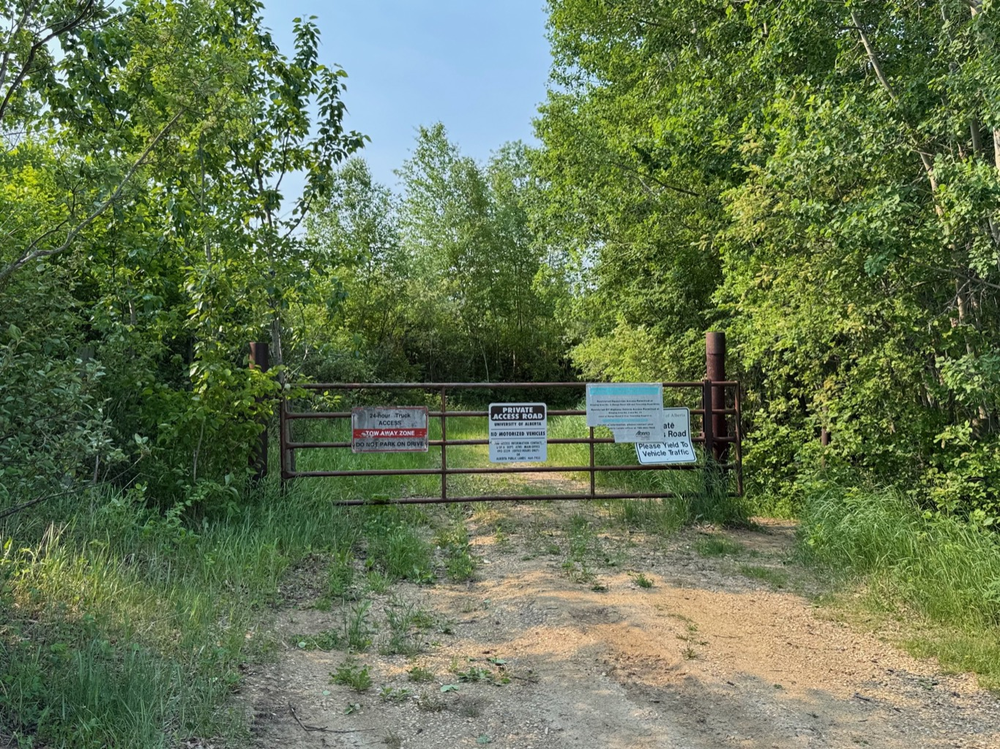

  

    <h4 class="text-xl font-large mt-0">Trailhead Details</h4>
      <table width=100% class="w-full">
      <tbody>
        <tr>
          <td valign="top" width="100%" class="mb-2 text-base" colspan="2"><b>🧭 GPS Location</b></td>
        </tr>
        <tr>
          <td valign="top" colspan="2" class="my-4 text-base"><a href="https://maps.app.goo.gl/p6NFvhybbCuPJVet9" target="_blank">N53 22.014 W112 57.904</a>(Opens in Google Maps) 
         
<a href="geo:53.366900,-112.965067">53.366900,-112.965067</a> (Opens in your default map app)

         
<a href="liberally.bouts.unworn://show?threewords=liberally.bouts.unworn">///liberally.bouts.unworn</a> (Opens in what3words - mobile only)

          </td>
        </tr>
        <tr>
          <td valign="top" class="mb-2 text-base"><b>🅿️ Parking</b></td>
        </tr>
        <tr>
          <td valign="top" colspan="2" class="my-4 text-base"><ul>
          <li>It’s fair to say that the U of A Access Road Gate is the “front door” of the Ministik. The gated road leads to a former  U of A Research Station. The facility seems to have been shuttered from many years, but the road itself is periodically cleared of deadfall and other obstacles.</li>

<li>This entrance gets by far the most traffic over the course of a year, maybe because there’s decent parking space, room for maybe three or even four cars in the ditch near the gate and for more if parked safely along the road east of the gate.</li> 

<li>Occasionally vehicles do have to access the road, so please don't block the gate when you park.</li> </ul>


Note that you should park well off the road here. Parking with two vehicle wheels just off the road at the top of the hill west of the gate may get you a ticket. Parking this way is unsafe because of the poor visibility for oncoming cars in either direction.


</td>
        </tr>
      </tbody>
      </table>
    

  


